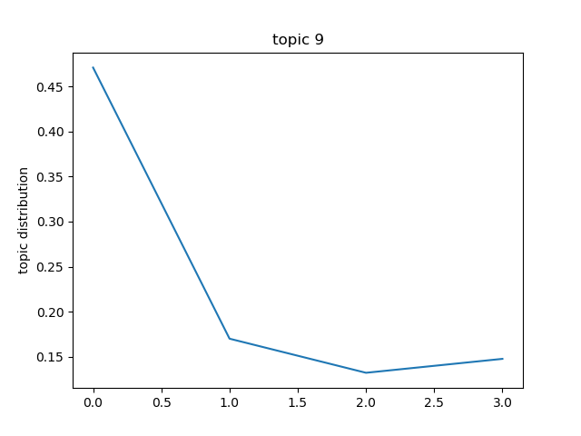

# Conference-Data-Analysis
### Introduction
Detect and visualize the topic change of conferences in AI area. Datasets are downloaded from [Aminer](https://aminer.org/open-academic-graph).
### Code Structure
<b>Latent Dirichlet Allocation Algorithm</b> can summary topics from the corpus of documents. By applying the whole words in `conference_list_extract.txt` to a lda model, this model can be used as a classification model. Providing the corpus of a document, this lda model returns the probability distribution vector in each topic. We average and normalize the vectors to get a final topic distribution. Most of the code logic resides in `topic.py`.      
Code in `abstrct.py` splits the data in `conference_list_extract.txt` into five areas, saving the data in `conference` directory. `abstract.py` also extracts the words in abstract for each paper in the datasets, and save them in `words` directory corresponding to each area.  
The common words in the corpus may mislead the lda model to misclassify the document. In the training and classification process, words with top idf value are eliminated. Words with corresponding idf value are stored in `idf` directory.
### Result
Images of the topics with dramatic fluctuation can be found in `img` directory. The x-label is the year, and the y-label is the component of this topic in topic distribution.  
Below is a sample of topic 9 for Artificial intelligence area from 2002-2013 

